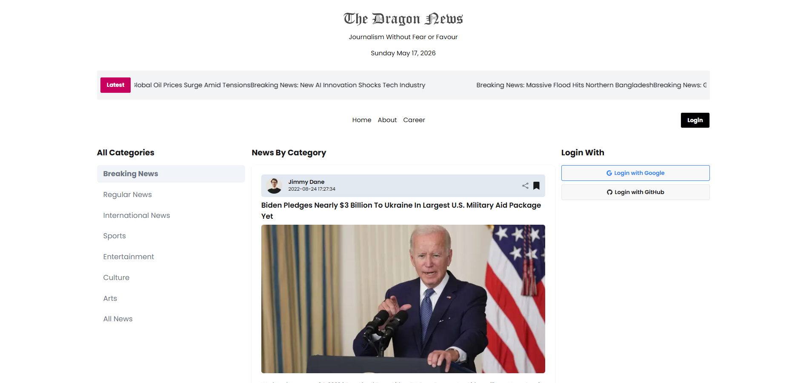

# 🐉 Dragon News

A modern and dynamic news platform built with Next.js where users can explore latest news, authenticate securely, and enjoy a clean responsive reading experience.

## 🚀 Live Demo

🌐 Live Site: https://dragon-news-gray.vercel.app/category/01  
💻 GitHub Repository: https://github.com/anika-chhoa/dragon-news.git

# 📸 Project Preview

> Homepage of Dragon-news platform



# 📖 Project Overview

Dragon News is a full-stack style news platform that fetches dynamic news from APIs and provides a smooth user experience with authentication and protected routes.

Users can browse news articles, log in securely, and access personalized features.

This project helped strengthen my understanding of authentication systems and real-world Next.js application structure.

# ✨ Key Features

- Dynamic news API integration
- Secure authentication system using Better Auth
- Login, Register & Logout functionality
- Google & GitHub social login
- Protected routes for authenticated users
- Clean, modern, and responsive UI
- Fully optimized with Next.js

# 🛠️ Technologies Used

## Frontend

- Next.js (App Router)
- Tailwind CSS
- React Icons

## Authentication

- Better Auth
- Google OAuth
- GitHub OAuth

## UI/UX

- Responsive Design
- Clean News Card Layout
- Toast Notifications

# 📦 Dependencies Used

```
next
react
react-dom
better-auth
tailwindcss
react-icons
axios
```

## ⚙️ Installation & Setup

Follow these steps to run the project locally:

### 1️⃣ Clone the Repository

```bash
git clone https://github.com/anika-chhoa/dragon-news.git
```

### 2️⃣ Navigate to Project Folder

```bash
cd dragon-news
```

### 3️⃣ Install Dependencies

```bash
npm install
```

### 4️⃣ Setup Environment Variables

Create a `.env.local` file:

```
NEXT_PUBLIC_BASE_URL=your_api_url
BETTER_AUTH_SECRET=your_secret
GOOGLE_CLIENT_ID=your_google_client_id
GOOGLE_CLIENT_SECRET=your_google_client_secret
GITHUB_CLIENT_ID=your_github_client_id
GITHUB_CLIENT_SECRET=your_github_client_secret
```

### 5️⃣ Run Development Server

```bash
npm run dev
```

Then open:
http://localhost:3000

🎯 Learning Outcomes
Authentication system implementation
OAuth login (Google & GitHub)
API integration for dynamic content
Protected routes in Next.js
Real-world full-stack project structure
UI/UX design improvement

🔥 Future Improvements
Comment system for news articles
Bookmark/save news feature
Category-based filtering
Admin dashboard for news management
Dark mode support
🔗 Relevant Links

🌐 Live Site: https://dragon-news-gray.vercel.app/category/01
💻 GitHub: https://github.com/anika-chhoa/dragon-news.git

👨‍💻 Author

Anika Mizan
Frontend Developer | React & Next.js Enthusiast | MERN Stack Learner
